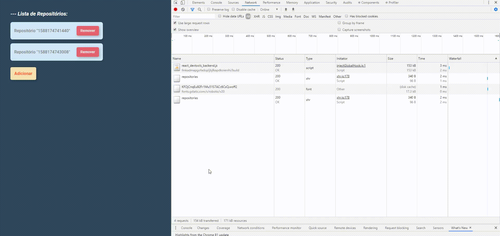
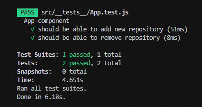

<h1 align="center">
  🚀 Conceitos de ReactJS 🚀
</h1>

<h3 align="center">
Desafio aplicado no Bootcamp GoStack da Rocketseat
</h3>

<h1>
  
</h1>

## Índice

- [Sobre](#-sobre)
- [Tecnologia utilizada](#-tecnologia-utilizada)
- [Objetivos](#-objetivos)
- [Testes de Validação](#-testes-de-validação)
- [Para clonar, acessar e executar o projeto](#-para-clonar-acessar-e-executar-o-projeto)
- [Para executar os testes](#-para-executar-os-teste)
- [Importante](#-importante)


---

## 🔖 Sobre

O propósito deste segundo Desafio é continuar a aplicação desenvolvida no primeiro Desafio (Conceitos do Nodejs) onde o intuito da aplicação é poder armazenar repositórios do seu portfólio, que irá permitir a criação, listagem, atualização e remoção dos repositórios, e além disso permitir que os repositórios possam receber "likes".

---

## 🚀 Tecnologia utilizada

- [ReactJS](https://reactjs.org)

---

## 🎯 Objetivos

Com este desafio foi proposto fazer a ligação do Front-end (utilizando o ReactJS) com o Back-end (Nodejs) onde os objetivos são:

- **Listar os repositórios da API criada com o Nodejs:**
Deve ser capaz de criar uma lista com o campo "title" de todos os repositórios cadastrados na API.

- **Adicionar um repositório a API:**
Deve ser capaz de adicionar um novo item na API através de um botão com o texto "Adicionar" e, após a criação, deve ser capaz de exibir o nome dele após o cadastro.

- **Remover um repositório da sua API:**
Para cada item da lista, deve possuir um botão com o texto "Remover" que, ao clicar, irá chamar uma função para remover esse item da lista do frontend e da API.

---

## 📝 Testes de Validação



Para que o desafio seja válido, a aplicação teve que passar por dois testes, que são eles:

- **Seja possível adicionar um novo repositório:**
Para que esse teste passe, a aplicação deve permitir que um repositório seja adicionado ao backend e listado no frontend dentro de uma "LI".

- **Seja possível remover um novo repositório:**
Para que esse teste passe, a aplicação deve permitir que ao clicar no botão de remover que vai estar dentro da LI do repositório adicionado, o item seja removido da listagem.

---

## ⚙ Para clonar e acessar e executar o projeto

```bash
  # clonar o projeto
  $ git clone https://github.com/DigooDS/conceitos-reactjs.git

  # acessar o projeto
  $ cd conceitos-reactjs

  # executar o projeto
  $ yarn start
```

---

## 🛠 Para executar os testes

```bash
  $ yarn test
```

---

## 📌 Importante
Para utilizar o **Back-end** desta aplicação, será necessário acessar, clonar e seguir as informações do link do repositório (Desafio 01) abaixo:

https://github.com/DigooDS/conceitos-nodejs

---
<i>Desenvolvido por RodrigoDS</i> 🤓